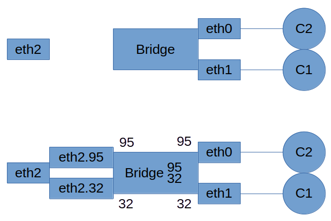

# NSD_Project

## Topologia di Rete


## Configurazioni di Rete

### AS 100
*Nota: Le considerazioni che saranno fatte per R101 valgono anche per R102 ed R103*.

#### R 101

##### R_101.sh
```bash
## To congifure VPN
ip link add vpnA type vrf table 10
ip link set vpnA up
ip link set eth0 master vpnA

## Configuring /etc/sysctl.conf
cat R_101_sysctl.conf > /etc/sysctl.conf
sysctl -p

vtysh < R_101_frr.conf

```
Si tratta dello script di inizializzazione:
- Viene prima di tutto configurata la vpn indicando:
	- Nome come *vpnA*
	- Identificativo *10*
	- Interfaccia dietro a cui si trova il Customer Edge per il sito corrispondente
- Si scrive la configurazione relativa ad MPLS sul file di configurazione
- Si eseguono i comandi *vtysh*
##### R_101_sysctl.conf
```
net.mpls.conf.lo.input = 1
net.mpls.conf.eth1.input = 1
net.mpls.conf.vpnA.input = 1
net.mpls.platform_labels = 100000
```
Si tratta della configurazione di MPLS; si specificano in particolare:
- Le interfacce che ricevono messaggi MPLS come input
	- In questo caso sono eth1 per i messaggi e loopback per messaggi di LDP
- Massimo numero di labels che MPLS può gestire
##### R_101_frr.conf
```
configure terminal

interface eth0
 ip address 10.1.1.1/30
exit
!
interface eth1
 ip address 10.0.11.1/30
exit
!
interface lo
 ip address 1.255.0.1/32
exit
!

router ospf
 ospf router-id 1.255.0.1
 network 1.255.0.1/32 area 0
 network 10.0.11.0/30 area 0
exit
!

mpls ldp
 router-id 1.255.0.1
 ordered-control
 address-family ipv4
  discovery transport-address 1.255.0.1
  interface eth1
  interface lo
 exit
exit
!

! Configuring Internal BGP
router bgp 100
	bgp router-id 1.255.0.1
	neighbor 1.255.0.2 remote-as 100
	neighbor 1.255.0.2 update-source 1.255.0.1
	neighbor 1.255.0.3 remote-as 100
	neighbor 1.255.0.3 update-source 1.255.0.1
	address-family ipv4 unicast
		neighbor 1.255.0.2 next-hop-self
		neighbor 1.255.0.3 next-hop-self
	exit
	address-family ipv4 vpn
		neighbor 1.255.0.2 activate
		neighbor 1.255.0.2 next-hop-self
		neighbor 1.255.0.3 activate
		neighbor 1.255.0.3 next-hop-self
	exit
exit
!


! Configuring Route Dist and Route Target
router bgp 100 vrf vpnA
	address-family ipv4 unicast
		redistribute static
		label vpn export auto
		rd vpn export 100:0
		rt vpn import 100:1
		rt vpn export 100:2
		export vpn
		import vpn
	exit
exit
!

! REMOVE THIS COMMAND
! ip route 192.168.0.0/24 10.1.1.2 vrf vpnA

router bgp 100 vrf vpnA
	address-family ipv4
		neighbor 10.1.1.2 remote-as 65001
	exit
exit


```
I comandi *vtysh* possono essere divisi nelle seguenti parti:
- I primi comandi sono relativi al setup degli indirizzi IP sulle interfacce del dispositivo
	- Sull'interfaccia di loopback viene configurato un indirizzo per evitare di legare i messaggi di gestione ad una specifica interfaccia fisica; in questo modo, anche in caso di guasti la configurazione può continuare a funzionare
- Configurazione OSPF
	- Ricordando che OSPF è un protocollo di instradamento Intra-AS, gli unici indirizzi che possono essere condivisi da questo router con questo protocollo sono quelli dell'AS stesso, quindi quello dell'interfaccia di loopback e quello del link eth1
- Configurazione LDP
	- Viene configurato LDP per eseguire sulle interfacce eth1 e loopback
- Configurazione Internal BGP
	- Si specifica quali sono gli altri peer (ovvero R102 ed R103) con gli indirizzi IP associati alle loro intrfacce di loopback. A questo è anche specificato la sorgente degli aggiornamenti BGP
	- Si configurano lo scambio di informazioni di VPN
		- Stiamo attivando la versione multiprotocollo di BGP per questi peer
- Configurazione Route Distinguisher e Route Target
	- Stiamo assegnando un certo route distinguisher alle informazioni relative alla vpnA: questo servirà per permettere agli engine BGP di distinguere spazi di indirizzamento sovrapposti in VPN diverse
	- Impostiamo poi i Route Target per costruire la topologia voluta della VPN: accettiamo in particolare le rotte che vengono con RT 100:1 (confrontare con RT esportato dall'HUB) e esportiamo i nostri messaggi con RT 100:2 (confrontare con RT importato dall'HUB)
- Configurazione Route Advertisement su link CE-PE
	- Configuriamo lo scambio di informazioni di rotte relative alla VRF con il CE: stiamo in particolare esportando le rotte della VPN vpnA con il router di frontiera (CE) appartenente al AS 65001.
	- Poiché il vicino è associato alla vrf vpnA, le rotte che da lui verranno ricevute saranno associate in automatico a questa vpn.

#### R 102

##### R_102.sh
```bash
ip link add vpnA type vrf table 10
ip link set vpnA up
ip link set eth0 master vpnA

cat R_102_sysctl.conf > /etc/sysctl.conf
sysctl -p

vtysh < R_102_frr.conf
```

##### R_102_sysctl.conf
```
net.mpls.conf.lo.input = 1
net.mpls.conf.eth1.input = 1
net.mpls.conf.vpnA.input = 1
net.mpls.platform_labels = 100000
```

##### R_102_frr.conf
```
configure terminal

interface eth0
 ip address 10.1.3.1/30
exit
!
interface eth1
 ip address 10.0.11.5/30
exit
!
interface lo
 ip address 1.255.0.2/32
exit
!

router ospf
 ospf router-id 1.255.0.2
 network 1.255.0.2/32 area 0
 network 10.0.11.4/30 area 0
exit
!

mpls ldp
	router-id 1.255.0.2
	ordered-control
	address-family ipv4
		discovery transport-address 1.255.0.2
		interface eth1
		interface lo
	exit
exit

! Configuring Internal BGP
router bgp 100
	bgp router-id 1.255.0.2 
	neighbor 1.255.0.1 remote-as 100
	neighbor 1.255.0.1 update-source 1.255.0.2
	neighbor 1.255.0.3 remote-as 100
	neighbor 1.255.0.3 update-source 1.255.0.2
	address-family ipv4 unicast
		neighbor 1.255.0.1 next-hop-self
		neighbor 1.255.0.3 next-hop-self
	exit
	address-family ipv4 vpn
		neighbor 1.255.0.1 activate
		neighbor 1.255.0.1 next-hop-self
		neighbor 1.255.0.3 activate
		neighbor 1.255.0.3 next-hop-self
	exit
exit

! Configuring Route Distinguisher and Route Target
router bgp 100 vrf vpnA
	address-family ipv4 unicast		
		label vpn export auto
		rd vpn export 100:0
		rt vpn import 100:2
		rt vpn export 100:1
		export vpn
		import vpn
	exit
exit
!

! REMOVE THIS COMMAND
! ip route 192.168.2.0/24 10.1.3.2 vrf vpnA

! Dynamic Routing between CE-PE
router bgp 100 vrf vpnA                       
        address-family ipv4                   
        neighbor 10.1.3.2 remote-as 65002                               
exit
!

! Comunication Spoke-Spoke
ip route 0.0.0.0/0 Null0 vrf vpnA
router bgp 100 vrf vpnA
	address-family ipv4 unicast
		network 0.0.0.0/0
	exit
exit


```

Oltre alla configurazione di prima, abbiamo qui anche l'esportazione di una rotta di default ai due spoke: questo permette ai due spoke di raggiungersi l'uno con l'altro. Quando cercheranno di contattare l'altro Spoke, il loro PE non conoscerà una rotta verso il PE corrispondente, ma conoscerà la rotta di default esportata dal PE Hub che invece conoscerà la rotta necessaria.

#### R 103

##### R_103.sh
```shell
ip link add vpnA type vrf table 10
ip link set vpnA up
ip link set eth0 master vpnA

cat R_103_sysctl.conf > /etc/sysctl.conf
sysctl -p

vtysh < R_103_frr.conf
```

##### R_103_sysctl.conf
```
net.mpls.conf.lo.input = 1
net.mpls.conf.eth1.input = 1
net.mpls.conf.vpnA.input = 1
net.mpls.platform_labels = 100000
```

##### R_103_frr.conf
```
configure terminal

interface eth0
 ip address 10.1.2.1/30
exit
!
interface eth1
 ip address 10.0.11.9/30
exit
!
interface lo
 ip address 1.255.0.3/32
exit
!

router ospf
 ospf router-id 1.255.0.3
 network 1.255.0.3/32 area 0
 network 10.0.11.8/30 area 0
exit
!

mpls ldp
	router-id 1.255.0.3
	ordered-control
	address-family ipv4
		discovery transport-address 1.255.0.3
		interface eth1
		interface lo
	exit
exit


! Configuring Internal BGP
router bgp 100
	bgp router-id 1.255.0.3
	neighbor 1.255.0.1 remote-as 100
	neighbor 1.255.0.1 update-source 1.255.0.3
	neighbor 1.255.0.2 remote-as 100
	neighbor 1.255.0.2 update-source 1.255.0.3
	address-family ipv4 unicast
		neighbor 1.255.0.1 next-hop-self
		neighbor 1.255.0.2 next-hop-self
	exit
	address-family ipv4 vpn
		neighbor 1.255.0.1 activate
		neighbor 1.255.0.1 next-hop-self
		neighbor 1.255.0.2 activate
		neighbor 1.255.0.2 next-hop-self
	exit
exit
!

! Configuring Route Distinguisher and Route Target
router bgp 100 vrf vpnA
	address-family ipv4 unicast
	redistribute static
	label vpn export auto
	rd vpn export 100:0
	rt vpn import 100:1
	rt vpn export 100:2
	export vpn
	import vpn
exit
!
                       
router bgp 100 vrf vpnA                       
        address-family ipv4                   
                neighbor 10.1.2.2 remote-as 65003
        exit                               
exit


```

#### R 104
R104 rappresenta il nostro LSR nella backbone MPLS: essendo questo un LSR non ha bisogno di essere un peer BGP perché l'instradamento verrà fatto sulla base delle label assegnate dai PE.
##### R_104.sh
```shell
cat R_104_sysctl.conf > /etc/sysctl.conf
sysctl -p

vtysh < R_104_frr.conf
```
##### R_104_sysctl.conf
```
net.mpls.conf.lo.input = 1
net.mpls.conf.eth0.input = 1
net.mpls.conf.eth1.input = 1
net.mpls.conf.eth2.input = 1
net.mpls.platform_labels = 100000
```
##### R_104_frr.conf
```
configure terminal

interface eth0
 ip address 10.0.11.2/30
exit
! 
interface eth1
 ip address 10.0.11.10/30
exit
!
interface eth2
 ip address 10.0.11.6/30
exit
!
interface lo
 ip address 1.255.0.4/32
exit
!

router ospf
 ospf router-id 1.255.0.4
 network 1.255.0.4/32 area 0
 network 10.0.11.0/30 area 0
 network 10.0.11.4/30 area 0
 network 10.0.11.8/30 area 0
exit
!

! Configuring Label Distribution Protocol
mpls ldp
	router-id 1.255.0.4
	ordered-control
	address-family ipv4
		discovery transport-address 1.255.0.4
		interface eth0
		interface eth1
		interface eth2
		interface lo
	exit
exit

```

Come già detto, in questo caso è sufficiente configurare solo il LDP: l'instradamento sarà fatto tramite label switch.

### VPN Site 1
*Nota: La discussione fatta per CE_1, vale similmente anche per CE_2 e CE_3*
#### CE 1
##### CE_1.sh
```shell
vtysh < CE_1_frr.conf
```

##### CE_1_frr.conf
```
configure terminal

interface eth0
 ip address 192.168.0.1/24
exit
!
interface eth1
 ip address 10.1.1.2/30
exit
!

! REMOVE THIS COMMAND
! ip route 0.0.0.0/0 10.1.1.1

router bgp 65001
	network 192.168.0.1/24
	neighbor 10.1.1.1 remote-as 100
exit


```
La parte significativa in questo caso è l'ultima parte dei comandi *vtysh*, in cui configuriamo la parte CE per BGP sul link CE-PE. Il router semplicemente configura la controparte come router di frontiera dell'AS 100 e gli invia rotte relative alla rete 192.168.0.1, che è proprio quella del sito 1 della VPN.
#### Client A1

##### Client_A1.sh
```shell
ip link set enp0s3 up
ip addr add 192.168.0.2/24 dev enp0s3
ip route add default via 192.168.0.1
```

### VPN Site 2

#### CE 2
##### CE_2.sh
```
vtysh < CE_2_frr.conf

ip link set eth0 up
ip addr add 192.168.4.1/24 dev eth0

ip link add link eth0 name eth0.95 type vlan id 95
ip link add link eth0 name eth0.32 type vlan id 32

ip link set eth0.95 up 
ip link set eth0.32 up 

ip addr add 192.168.3.1/24 dev eth0.95
ip addr add 192.168.1.1/24 dev eth0.32

```
In questo caso oltre alla configurazione *vtysh* abbiamo anche la configurazione delle VLAN all'interno del sito 2. Nello specifico:
- Viene associato un indirizzo IP per la comunicazione tra Router e Switch 
- Vengono costruite delle interfacce virtuali, ognuna associata ad una specifica VLAN e legate all'interfaccia fisica eth0 che è l'interfaccia da cui arriveranno i pacchetti delle diverse VLAN
- Si associano degli indirizzi IP in ciascuna VLAN alle interfacce virtuali corrispondenti

##### CE_2_frr.conf
```
configure terminal

interface eth0
	! ip address 192.168.4.1/24
exit
!

interface eth1
	ip address 10.1.2.2/30
exit
!

router bgp 65003
	network 192.168.4.1/24
	network 192.168.3.1/24
	network 192.168.1.1/24
	neighbor 10.1.2.1 remote-as 100
exit

```

#### Switch
##### Switch.sh
```bash
# Creating and configuring the bridge for auth requests
ip link add bridge type bridge
ip link set bridge up
ip link set dev eth0 master bridge
ip link set dev eth1 master bridge
ip link set dev bridge type bridge vlan_filtering 1

# Configuring traffic on eth2
ip link set eth2 up
ip addr add 192.168.4.2/24 dev eth2
ip route add default via 192.168.4.1

# Configure the default ACL policies
ebtables -F
ebtables -P FORWARD DROP
ebtables -P INPUT ACCEPT
ebtables -P OUTPUT ACCEPT

# Enable EAPoL fwd
echo 8 > /sys/class/net/bridge/bridge/group_fwd_mask

cat ./Switch_hostapd.conf > /etc/hostapd/hostapd.conf

```
Passi di configurazione:
- Viene costruito un bridge virtuale che sappia gestire le VLAN e gli vengo date in gestione le interfacce fisiche verso i dispositivi (non quello verso il router)
- Viene configurata la eth2, dando un indirizzo che permetta di comunicare con il router fuori dalle VLAN
- Vengono pulite le regole ebtables e bloccato tutto il traffico in forward: ciò significa che lo switch non farà forward di nessun pacchetto a meno che non ci sia una regola specifica a permetterlo
##### Switch_hostapd.conf
```
# Control interface settings
ctrl_interface=/var/run/hostapd
ctrl_interface_group=0

# Enable logging for all modules
logger_syslog=-1
logger_stdout=-1

# Log level
logger_syslog_level=2
logger_stdout_level=2

# Driver interface type
driver=wired

# Enable IEEE 802.1X authorization
ieee8021x=1

# Use port access entry (PAE) group address
# (01:80:c2:00:00:03) when sending EAPOL frames
use_pae_group_addr=1

# Network interface for authentication requests
interface=bridge

# Local IP address used as NAS-IP-Address
own_ip_addr=192.168.4.2

# Unique NAS-Identifier within scope of RADIUS server
nas_identifier=hostapd.example.org

# RADIUS authentication server
auth_server_addr=192.168.2.2
auth_server_port=1812
auth_server_shared_secret=radiussecret

```
Notiamo in particolare che:
- L'interfaccia da cui arriveranno le richieste è quella virtuale del bridge a cui infatti sono attaccate le interface verso i client
- L'indirizzo IP usato per inviare le richieste al server è quello che è stato configurato su eth2
- Il server Radius usato è quello che si trova nel sito 3 della VPN
#### Client B1
##### Client_B1.sh
```bash
ip link set eth0 up
ip addr add 192.168.1.2/24 dev eth0
ip route add default via 192.168.1.1
 
cd
 
cat Client_B1_supplicant.conf > /etc/wpa_supplicant.conf

```

##### Client_B1_supplicant.conf
```
ap_scan=0
network={
    key_mgmt=IEEE8021X
    eap=MD5
    identity="Client_B1"
    password="Client_B1"
    eapol_flags=0
}

```

#### Client B2
##### Client_B2.sh
```bash
ip link set eth0 up
ip addr add 192.168.3.2/24 dev eth0
ip route add default via 192.168.3.1
 
cd

cat Client_B2_supplicant.conf > /etc/wpa_supplicant.conf

```

##### Client_B2_supplicant.conf
```
ap_scan=0
network={
    key_mgmt=IEEE8021X
    eap=MD5
    identity="Client_B2"
    password="Client_B2"
    eapol_flags=0
}

```

### VPN Site 3

#### CE 3

##### CE_3.sh
```bash
vtysh < CE_3_frr.conf
```

##### CE_3_frr.conf
```
configure terminal

interface eth0
 ip address 192.168.2.1/24
exit
!
interface eth1
 ip address 10.1.3.2/30
exit
!

! REMOVE THIS COMMAND
! ip route 0.0.0.0/0 10.1.3.1

router bgp 65002
        network 192.168.2.1/24
        neighbor 10.1.3.1 remote-as 100
exit


```

#### Radius Server

##### Radius.sh
```
ip link set eth0 up
ip addr add 192.168.2.2/24 dev eth0
ip route add default via 192.168.2.1

cd

cat ./Radius_clients.conf > /etc/freeradius/3.0/clients.conf
cat ./Radius_users.conf > /etc/freeradius/3.0/users

service freeradius start

```
##### Radius_clients.conf
```
client cumulus1 {
	ipaddr = 192.168.4.2
	secret = "radiussecret"
	shortname = projetc 
}

```
Si imposta qui l'indirizzo IP dell'authentication device da cui arriveranno le richieste: si tratta proprio dell'indirizzo dello Switch.
##### Radius_users.conf
```
Client_B1	Cleartext-Password := "Client_B1"
			Service-Type = Framed-User,
			Tunnel-Type = 13,
			Tunnel-Medium-Type = 6,
			Tunnel-Private-Group-ID = 32

Client_B2	Cleartext-Password := "Client_B2"
			Service-Type = Framed-User,
			Tunnel-Type = 13,
			Tunnel-Medium-Type = 6,
			Tunnel-Private-Group-ID = 95
```
Si impostano le informazioni relative agli utenti che si autenticano: notare le informazioni di VLAN che verranno aggiunte al messaggio Radius come attributi in caso di successo.

## Configurazione di Sistema

### App Armor in Client A1

#### Profilo FTP
```
# Last Modified: Wed Feb  5 15:47:59 2025
abi <abi/3.0>,

include <tunables/global>

/usr/bin/tnftp {
  include <abstractions/apache2-common>
  include <abstractions/base>
  include <abstractions/bash>

  /etc/nsswitch.conf r,
  /etc/passwd r,
  /usr/bin/tnftp mr,
  owner /proc/*/loginuid r,
  
  deny network,
}

```

#### Profilo Telnet
```
# Last Modified: Tue Feb  4 19:11:26 2025
abi <abi/3.0>,

include <tunables/global>

/usr/bin/inetutils-telnet {
  include <abstractions/base>

  /bin/inetutils-telnet mr,

  deny network,
}
```

#### Codice e Profilo my_cat

##### Codice my_cat
```
#!/usr/bin/python3
import sys

def cat(filename):
    try:
        with open(filename, 'r') as file:
            print(file.read(), end='')
    except FileNotFoundError:
        print(f"Error: The file '{filename}' was not found.")
    except PermissionError:
        print(f"Error: Permission denied to read the file '{filename}'.")

if __name__ == "__main__":
    if len(sys.argv) < 2:
        print("Usage: python cat.py <filename>")
    else:
        filename = sys.argv[1]
        cat(filename)

```

##### Profilo my_cat
```
#include <tunables/global>

profile /home/simone/my_cat flags=(enforce) {

  /home/simone/my_cat r,
  /home/simone/my_cat ux,

  # Allow read access to required libraries
  include <abstractions/base>
  include <abstractions/python>

  # Allow execution of the Python interpreter
  /usr/bin/python3 rmix,

  # Allow read access to specific directories
  /home/simone/allowed_dir/** r,

}
```

#### update_profiles.sh
```
## MY_CAT
cat my_cat_profile > /etc/apparmor.d/home.simone.my_cat
apparmor_parser /etc/apparmor.d/home.simone.my_cat
apparmor_parser -r /etc/apparmor.d/home.simone.my_cat

## TELNET
cat telnet_profile > /etc/apparmor.d/usr.bin.inetutils-telnet
apparmor_parser /etc/apparmor.d/usr.bin.inetutils-telnet
apparmor_parser -r /etc/apparmor.d/usr.bin.inetutils-telnet

## FTP
cat ftp_profile > /etc/apparmor.d/usr.bin.tnftp
apparmor_parser /etc/apparmor.d/usr.bin.tnftp
apparmor_parser -r /etc/apparmor.d/usr.bin.tnftp

## Enforce or Disable
if [ $1 -eq 0 ]
then
        aa-enforce /etc/apparmor.d/home.simone.my_cat
        aa-enforce /etc/apparmor.d/usr.bin.inetutils-telnet
        aa-enforce /etc/apparmor.d/usr.bin.tnftp
else
        aa-disable /etc/apparmor.d/home.simone.my_cat
        aa-disable /etc/apparmor.d/usr.bin.inetutils-telnet
        aa-disable /etc/apparmor.d/usr.bin.tnftp
fi

```


## Configurazione Switch eBPF

### xdp-tutorial/project/Makefile
```
# SPDX-License-Identifier: (GPL-2.0 OR BSD-2-Clause)

XDP_TARGETS  := xdp_radius_kern xdp_eap_kern
USER_TARGETS := xdp_user xdp_loader

COMMON_DIR := ../common
COMMON_OBJS := $(COMMON_DIR)/common_user_bpf_xdp.o

include $(COMMON_DIR)/common.mk

```

### xdp-tutorial/project/xdp_radius_kern.c
```c
#include <linux/bpf.h>
#include <linux/if_ether.h>
#include <linux/ip.h>
#include <linux/udp.h>
#include <linux/in.h>

#include <bpf/bpf_helpers.h>
#include <bpf/bpf_core_read.h>

#include "./xdp_common.h"

#include <stdbool.h> 

#define RADIUS_PORT 1812
#define RADIUS_MAX_LENGTH 4096
#define RADIUS_ATTR_INFO_LENGTH 2
#define RADIUS_ATTR_VALUE_MAX_LENGTH 256
#define RADIUS_MAX_ATTRIBUTES_NUM 256
#define RADIUS_HEADER_SIZE 20

#define ACCESS_ACCEPT 2
#define ACCESS_REQUEST 1

#define TUNNEL_TYPE_TYPE 64
#define TUNNEL_MEDIUM_TYPE_TYPE 65
#define TUNNEL_PRIVATE_GROUP_ID_TYPE 81
#define USER_NAME_TYPE 1
#define EAP_MESSAGE_TYPE 79

#define CONTINUE_PROCESS -1


struct radius_hdr {
    __u8 code;                  
    __u8 identifier;            
    __u16 length;               
    __u8 authenticator[16];     
};

struct radius_attr_info {
    __u8 type;
    __u8 length;
};


struct {
    __uint(type, BPF_MAP_TYPE_HASH);
    __type(key, __u8);
    __type(value, struct vlan_info);
    __uint(max_entries, MAP_ENTRIES_NUM);
    __uint(pinning, LIBBPF_PIN_BY_NAME);
} vlan_map SEC(".maps");


static __always_inline __u8 is_access_save(void *start, __u64 size, void *end) {
    if ((__u8 *)start + size > end) {
        return false ;
    }
    return true ;
} 


static int check_packet_headers(void *data, void *data_end, struct udphdr **udp_pack) {
    struct ethhdr *eth = data;
    struct iphdr *ip;
    struct udphdr *udp;
    // Ensure Ethernet header is within bounds
    if (!is_access_save(eth, sizeof(struct ethhdr), data_end))
        return XDP_DROP;
        
    // Check if the packet is IPv4
    if (eth->h_proto != __constant_htons(ETH_P_IP)) {
        return XDP_PASS;
    }


    ip = (struct iphdr *)(eth + 1);

    // Ensure IP header is within bounds
    if (!is_access_save(ip, sizeof(struct iphdr), data_end))
        return XDP_DROP;

    // Check if the protocol is UDP
    if (ip->protocol != IPPROTO_UDP)
        return XDP_PASS;

    udp = (struct udphdr *)((__u8 *)ip + (ip->ihl * 4));

    // Ensure UDP header is within bounds
    if (!is_access_save(udp, sizeof(struct udphdr), data_end))
        return XDP_DROP;
    
    *udp_pack = udp;

    return CONTINUE_PROCESS;
}


static int parse_radius_attributes(struct radius_hdr *radius_hdr, void *data_end) {
    struct radius_attr_info *curr_attr_info = (struct radius_attr_info *)(radius_hdr + 1) ;

    // TODO --> Check this loop
    // bpf_printk("Entering Attributes Parsing Loop") ;
    // Some attributes are strings and others are ints: check the type carefully
    struct vlan_info vlan = {"\0", "\0"};
    struct eap_hdr eap = {0, 0, 0} ;
    for (int i = 0 ; i < RADIUS_MAX_ATTRIBUTES_NUM ; i++) {
        if (!is_access_save(curr_attr_info, 0, data_end)) 
            break ;
        if (!is_access_save(curr_attr_info, sizeof(curr_attr_info), data_end))
            break ;

        void *curr_attr_value_ptr = (void *)(curr_attr_info + 1) ;

        __u8 attr_type = curr_attr_info->type;
        __u8 attr_len = curr_attr_info->length ;
        __u8 value_len = attr_len - 2 ;
        //bpf_printk("(Type = %d, Attr Len = %d, Value Len = %d)", attr_type, attr_len, value_len) ;

        if (is_access_save(curr_attr_value_ptr, value_len, data_end)) {
            char *target_field = NULL;
            if (attr_type == TUNNEL_PRIVATE_GROUP_ID_TYPE) {
                target_field = vlan.vlan_id ;
            }
            if (attr_type == USER_NAME_TYPE) {
                target_field = vlan.user_id ;
                // bpf_core_read_str(value, value_len + 1, curr_attr_value_ptr); // +1 is for the string terminator
                // bpf_printk("User ID >> %s", value);
            }
            if (attr_type == EAP_MESSAGE_TYPE) {
                bpf_core_read(&eap, sizeof(struct eap_hdr), curr_attr_value_ptr) ;
            }

            // I think that included in size it counts the terminator too
            // I need to add one in order to get the last char
            if (target_field != NULL) {
                if (value_len > MAP_FIELD_LENGTH - 1) {
                    bpf_core_read_str(target_field, MAP_FIELD_LENGTH - 1, curr_attr_value_ptr) ;
                } else {
                    bpf_core_read_str(target_field, value_len + 1, curr_attr_value_ptr) ;
                }
            }
        }

        curr_attr_info = (struct radius_attr_info *)((__u8 *)curr_attr_info + attr_len) ;
    }
    bpf_map_update_elem(&vlan_map, &(eap.id), &vlan, BPF_NOEXIST) ;
    bpf_printk("Response (User = %s, VLAN = %s, ID = %d)", vlan.user_id, vlan.vlan_id, eap.id) ;

    return CONTINUE_PROCESS ;
}

static int check_is_radius(struct udphdr *udp, void *data_end) {
    // Check if the destination port is RADIUS
    if (udp->source == __constant_htons(RADIUS_PORT))
        return true;
    
    if (udp->dest == __constant_htons(RADIUS_PORT))
        return true;
    
    return false;
}

static int check_radius_packet(struct udphdr *udp, void *data_end, struct radius_hdr **radius) {
    // Extract RADIUS header
    struct radius_hdr *radius_hdr = (struct radius_hdr *)(udp + 1);

    // Check RADIUS header bounds
    if (!is_access_save(radius_hdr, sizeof(struct radius_hdr), data_end)) 
        return XDP_DROP;
    
    *radius = radius_hdr ;

    return CONTINUE_PROCESS;
}


SEC("xdp")
int xdp_parse_radius(struct xdp_md *ctx) {
    void *data_end = (void *)(long)ctx->data_end;
    void *data = (void *)(long)ctx->data;

    int action ;

    struct udphdr *udp_pack ;
    action = check_packet_headers(data, data_end, &udp_pack) ;
    if (action != CONTINUE_PROCESS) {
        return action ;
    }

    int is_radius = check_is_radius(udp_pack, data_end) ;
    if (!is_radius) {
        return XDP_PASS;
    }
    
    struct radius_hdr *radius_hdr = NULL;
    action = check_radius_packet(udp_pack, data_end, &radius_hdr);
    if (action != CONTINUE_PROCESS) {
        return action ;
    }
    if (radius_hdr->code != ACCESS_ACCEPT) {
        return XDP_PASS;
    }

    action = parse_radius_attributes(radius_hdr, data_end) ;
    if (action != CONTINUE_PROCESS) {
        return action ;
    }

    return XDP_PASS;

}

char _license[] SEC("license") = "GPL";

```

### xdp-tutorial/project/xdp_eap_kern.c
```c
#include <linux/bpf.h>
#include <linux/if_ether.h>
#include <linux/ip.h>
#include <linux/udp.h>
#include <linux/in.h>

#include <bpf/bpf_helpers.h>
#include <bpf/bpf_core_read.h>

#include <stdbool.h> 

#include "./xdp_common.h"

#define ETH_P_8021X 0x888e
#define EAP_PACKET_TYPE 0
#define EAP_RESPONSE_CODE 2
#define EAP_MD5_CHALLENGE_TYPE 4

#define CONTINUE_PROCESS -1

struct auth_hdr {
    __u8 version;
    __u8 type;
    __u16 length;
} ;

struct eap_payload {
    __u8 type;
} ;


struct {
    __uint(type, BPF_MAP_TYPE_HASH);
    __type(key, __u8);
    __type(value, struct mac_info);
    __uint(max_entries, MAP_ENTRIES_NUM);
    __uint(pinning, LIBBPF_PIN_BY_NAME);
} eap_map SEC(".maps");


static __always_inline __u8 is_access_save(void *start, __u64 size, void *end) {
    if ((__u8 *)start + size > end) {
        return false ;
    }
    return true ;
} 


static int check_and_parse(void *data, void *data_end, __u8 *eap_id, __u8 **eth_src) {
    struct ethhdr *eth = data;
    // Ensure Ethernet header is within bounds
    if (!is_access_save(eth, sizeof(struct ethhdr), data_end))
        return XDP_DROP;
        
    // Check if the packet is 802.1x
    if (eth->h_proto != __constant_htons(ETH_P_8021X)) {
        return XDP_PASS;
    }

    struct auth_hdr *auth = (struct auth_hdr *)(eth + 1) ;
    if (!is_access_save(auth, sizeof(struct auth_hdr), data_end)) {
        return XDP_DROP ;
    }

    if (auth->type != EAP_PACKET_TYPE) {
        return XDP_PASS ;
    }

    struct eap_hdr *eap = (struct eap_hdr *)(auth + 1) ;
    if (!is_access_save(eap, sizeof(struct eap_hdr), data_end)) {
        return XDP_DROP;
    }

    if (eap->code != EAP_RESPONSE_CODE) {
        return XDP_PASS ;
    }

    struct eap_payload *eap_pay = (struct eap_payload *)(eap + 1) ;
    if (!is_access_save(eap_pay, sizeof(struct eap_payload), data_end)) {
        return XDP_DROP ;
    }
    if (eap_pay->type != EAP_MD5_CHALLENGE_TYPE) {
        return XDP_PASS ;
    }

    *eap_id = eap->id ;
    *eth_src = eth->h_source;

    return CONTINUE_PROCESS;
}


SEC("xdp")
int xdp_parse_eap(struct xdp_md *ctx) {
    void *data_end = (void *)(long)ctx->data_end;
    void *data = (void *)(long)ctx->data;

    __u8 eap_id ;
    __u8 *eth_src = NULL ;

    int action ;
    action = check_and_parse(data, data_end, &eap_id, &eth_src) ;
    if (action != CONTINUE_PROCESS) {
        return action ;
    }

    struct mac_info info = { {0}, 0 } ;
    bpf_core_read(info.mac, ETH_ALEN, eth_src) ;
    info.origin_itf = ctx->ingress_ifindex;

    bpf_map_update_elem(&eap_map, &eap_id, &info, BPF_NOEXIST) ;

    bpf_printk("Request (ID = %d, Itf = %d)", eap_id, ctx->ingress_ifindex) ;

    return XDP_PASS;

}

char _license[] SEC("license") = "GPL";

```

### xdp-tutorial/project/xdp_loader.c
Si tratta di una copia del loader generico fornito da *xdp-tutorial*. Per evitare di appesantire il file il suo codice non viene riportato.

### xdp-tutorial/project/xdp_loader.c
```c
#include <bpf/bpf.h>
#include <stdio.h>
#include <errno.h>
#include <stdlib.h>
#include <unistd.h>
#include <string.h>
#include <net/if.h>
#include <stdbool.h>
#include <string.h>

#include "./xdp_common.h"

#define VLAN_MAP_PATH "/sys/fs/bpf/vlan_map"
#define EAP_MAP_PATH "/sys/fs/bpf/eap_map"


#define COMMAND_MAX_LENGTH 256
#define MAC_STRING_BUFFER_LENGTH 18
#define ITF_NAME_SIZE 32


void mac_bytes_to_string(const __u8 mac[ETH_ALEN], char *mac_str, size_t str_size) {
    if (str_size < MAC_STRING_BUFFER_LENGTH) { // Ensure buffer is large enough
        return;
    }
    snprintf(mac_str, str_size, "%02X:%02X:%02X:%02X:%02X:%02X",
             mac[0], mac[1], mac[2], mac[3], mac[4], mac[5]);
}

int itf_index_to_name(int ifindex, char *ifname, size_t ifname_size) {
    if (if_indextoname(ifindex, ifname) == NULL) {
        return -1;
    }
    return 0;
}

int run_command(char *command) {
    printf("\tRunning >> %s\n", command) ;
    return system(command) ;
}

int allow_traffic(char *src_mac) {
    char command[COMMAND_MAX_LENGTH] ;

    snprintf(command, COMMAND_MAX_LENGTH - 1, "ebtables -A FORWARD -s %s -j ACCEPT", src_mac) ;
    run_command(command) ;
    return 0 ;
}


int configure_vlan(char *itf_name, char *vlan_id) {
    char command[COMMAND_MAX_LENGTH] ;

    // Creating and upping interface for new vlan
    snprintf(command, COMMAND_MAX_LENGTH - 1, "ip link add link eth2 name eth2.%s type vlan id %s", vlan_id, vlan_id) ;
    run_command(command) ;
    snprintf(command, COMMAND_MAX_LENGTH - 1, "ip link set eth2.%s up", vlan_id) ;
    run_command(command) ;

    // Binding new vlan virtual interface to the bridge
    snprintf(command, COMMAND_MAX_LENGTH - 1, "ip link set dev eth2.%s master bridge", vlan_id) ;
    run_command(command) ;

    // Configuring vlan ports on the bridge
    snprintf(command, COMMAND_MAX_LENGTH - 1, "bridge vlan add dev eth2.%s vid %s pvid %s untagged", vlan_id, vlan_id, vlan_id);
    run_command(command) ;
    snprintf(command, COMMAND_MAX_LENGTH - 1, "bridge vlan add dev %s vid %s pvid %s untagged", itf_name, vlan_id, vlan_id);
    run_command(command) ;

    // Allowing traffic coming to VLAN interface
    snprintf(command, COMMAND_MAX_LENGTH - 1, "ebtables -A FORWARD -i eth2.%s -j ACCEPT", vlan_id) ;
    run_command(command) ;

    return 0 ;
}


int main() {
    // Get the map by path
    int vlan_map_fd = bpf_obj_get(VLAN_MAP_PATH);
    if (vlan_map_fd < 0) {
        fprintf(stderr, "Failed to get VLAN map: %s\n", strerror(errno));
        return 1;
    }
    int eap_map_fd = bpf_obj_get(EAP_MAP_PATH);
    if (eap_map_fd < 0) {
        fprintf(stderr, "Failed to get EAP map: %s\n", strerror(errno));
        return 1;
    }

    struct mac_info mac_info ;
    struct vlan_info vlan_info ;
    char string_mac[MAC_STRING_BUFFER_LENGTH] ;
    char itf_name[ITF_NAME_SIZE];
    __u8 key ;
    while (1) {
        int valid_key = bpf_map_get_next_key(vlan_map_fd, NULL, &key) ;
        if (valid_key == 0) {
            printf("Retrieved Key %d\n", key) ;

            int valid_vlan_entry = bpf_map_lookup_and_delete_elem(vlan_map_fd, &key, &vlan_info);
            int valid_mac_entry = bpf_map_lookup_and_delete_elem(eap_map_fd, &key, &mac_info);

            if (valid_vlan_entry == 0 && valid_mac_entry == 0) {
                mac_bytes_to_string(mac_info.mac, string_mac, sizeof(string_mac)) ;
                itf_index_to_name(mac_info.origin_itf, itf_name, sizeof(itf_name)) ;

                printf("(User %s, VLAN %s, Itf Idx %d, Itf Name %s, MAC %s)\n", vlan_info.user_id, vlan_info.vlan_id, mac_info.origin_itf, itf_name, string_mac);
                
                allow_traffic(string_mac) ;
                configure_vlan(itf_name, vlan_info.vlan_id) ;
            } else {
                printf("One entry is invalid\n") ;
            }
            printf("----------------------------------------------------------------\n") ;
        }
        sleep(2);
    }
    
    return 0;
}
```

### xdp-tutorial/project/xdp_common.c
```c
#include <linux/bpf.h>
#include <linux/if_ether.h>
#include <linux/ip.h>
#include <linux/udp.h>
#include <linux/in.h>

#define MAP_FIELD_LENGTH 64
#define MAP_ENTRIES_NUM 128

struct eap_hdr {
    __u8 code;
    __u8 id;
    __u16 length;
} ;

struct mac_info {
    __u8 mac[ETH_ALEN] ;
    __u32 origin_itf ;
} ;

struct vlan_info { 
    char user_id[MAP_FIELD_LENGTH] ;
    char vlan_id[MAP_FIELD_LENGTH] ;
};
```

### load_xdp_program.sh
```sh
ip link set eth0 xdp off
ip link set eth1 xdp off
ip link set eth2 xdp off

cd ./xdp-tutorial/project
make
echo

echo "#################### Loading on eth0 ####################"
./xdp_loader -A --dev eth0 --filename xdp_eap_kern.o --progname xdp_parse_eap
echo "#########################################################"
echo

echo "#################### Loading on eth1 ####################"
./xdp_loader -A --dev eth1 --filename xdp_eap_kern.o --progname xdp_parse_eap
echo "#########################################################"
echo

echo "#################### Loading on eth2 ####################"
./xdp_loader -A --dev eth2 --filename xdp_radius_kern.o --progname xdp_parse_radius
echo "#########################################################"

echo
echo 
echo "##################### Starting User #####################"
./xdp_user

cd
```

### Considerazioni
Ci sono due programmi xdp che vengono caricati:
- Il programma caricato su eth1 e eth0 per intercettare e parsare i messaggi EAP che vengono dal client. Da questi messaggi vengono estratte le seguenti informazioni:
	- Indirizzo MAC del supplicant (per abilitare il forward in ebtables)
	- Interfaccia di arrivo del messaggi (per la successiva configurazione della VLAN su quella porta)
	- L'ID del messaggio EAP (per associare la risposta Radius corrispondente)
- Il programma caricato su eth2 per intercettare e parsare i messaggi Radius che vengono dal Radius Server. Da questi messaggi vengono estratti:
	- L'ID del messaggio EAP
	- L'identificativo della VLAN

Abbiamo quindi due mappe:
- EAP Map
	- Key: EAP Message ID
	- Value: (Mac Addr, Origin Itf)
- Radius Map
	- Key: EAP Message ID
	- Value: (User ID, VLAN ID)

Queste informazioni sono messe in due mappe pinnate nel sistema; in una mappa vengono messe le informazioni estratte dai messaggi EAP, mentre in un'altra le informazioni estratte dai messaggi Radius. La chiave usata è l'ID dei messaggi EAP.

Il processo User legge e cancella dalla mappa Radius le informazioni di un client che si è autenticato con successo, ottenendo quindi l'ID del messaggio EAP; con questo valore viene poi estratto il valore corrispondente nella mappa EAP. Da cui quindi il programma ha la tupla (Mac Addr, Origin Itf, User ID, VLAN ID) che viene usata per configurare la VLAN; nello specifico:
1. Viene creata un'interfaccia virtuale su eth2 associata alla VLAN in questione
2. Questa interfaccia virtuale viene collegata al Bridge
	1. Viene impostata come untagged e associata alla VLAN sul bridge (viene configurata untagged perché il traffico è taggato dall'interfaccia stessa)
3. L'interfaccia di origine viene associata alla VLAN di appartenenza con traffico untagged
4. Viene permesso il forwarding del traffico
	1. Proveniente dal dispositivo autenticato tramite il suo MAC
	2. Proveniente dall'interfaccia virtuale creata per far passare l'eventuale traffico di risposta

La situazione dopo l'autenticazione di entrambi i dispositivi sarà quella rappresentata nella figura in seguito. Il traffico proveniente da un dispositivo sarà inoltrato solo sulle porte della stessa VLAN; quando è destinato ad un dispositivo non nella stessa VLAN, allora uscirà attraverso l'interfaccia eth2.vlan_id: l'interfaccia virtuale si occuperà di taggarlo. Una volta taggato il traffico uscirà dall'interfaccia fisica eth2 per andare al router: a sua volta il router gestirà o un cambio di etichetta (nel caso la destinazione si trovi nello stesso sito) o inoltrerà il pacchetto all'hub (nel caso la destinazione si trovi in un sito diverso).

